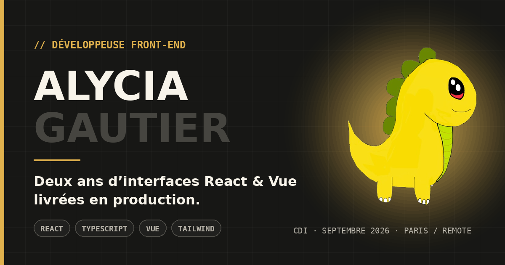

# Portfolio — Alycia Gautier



Personal portfolio, built from scratch with React 18, TypeScript and Vite.

**Live:** <https://portfolio-topaz-zeta-15.vercel.app>

The site ships **two positionings from one codebase**: a front-end developer
pitch at `/` and a cybersecurity one at `/cyber`, each in French and English,
each with its own résumé. That constraint is what shaped the architecture below,
and it is the part of this repo worth reading.

---

## Stack, and why

| Choice | Reason |
|---|---|
| React 18 + TypeScript | `strict`, `noUnusedLocals` and `noUnusedParameters` are on — the compiler is the first reviewer |
| Vite | Instant HMR, and `tsc && vite build` fails the build on any type error |
| Plain CSS, one file per component | The site is a dozen sections with heavy bespoke motion. A utility framework would have been more config than payoff; design tokens live as custom properties in `src/styles/App.css` |
| Self-hosted fonts | Syne and Space Mono carry every heading and label. Linking Google Fonts put a render-blocking third-party stylesheet on the critical path; `scripts/vendor-fonts.mjs` vendors the latin subsets instead, and the built page makes no third-party requests |
| `eslint-plugin-jsx-a11y` | The homepage lists accessibility as a skill. CI runs with `--max-warnings 0`, so that claim is enforced rather than asserted |
| No router | Two routes, resolved from `window.location.pathname`. React Router would be ~10 kB to replace six lines (`src/i18n/profile.ts`) |
| No state library | The only cross-cutting state is language + positioning, which is one context |

Runtime dependencies: `react` and `react-dom`. That is the whole list.

## Running it

```bash
npm ci
npm run dev        # http://localhost:5173
npm run build      # tsc && vite build && build-routes → dist/
npm run preview    # serve the production build

npm test            # vitest, watch mode
npm run test:run    # single pass
npm run test:coverage  # single pass + coverage thresholds, what CI runs
npm run typecheck   # tsc --noEmit
npm run lint
```

Every push runs lint, typecheck, tests and build
([`.github/workflows/ci.yml`](.github/workflows/ci.yml)).

Docker, for a matching dev environment: `docker compose up`.

## Architecture

```
src/
├── components/     # one presentational component per section + UI primitives
├── constants/      # content.ts — all copy, both languages, both positionings
├── i18n/           # LanguageContext (state), profile.ts (routing), meta.ts +
│                   #   document-meta.json (<head>, shared with the build)
├── hooks/          # useCursorTracker
├── styles/         # App.css (tokens + globals), fonts.css, components/*.css
└── types/          # every shape the content pipeline produces
```

### The content pipeline

Copy is not scattered across components. `src/constants/content.ts` splits
**structure** from **text**:

- *Language-neutral metadata* — `PROJECTS_META`, `SKILLS_META`, `VIDEOS_META`,
  `CONTACT_META` — declares what exists, once.
- *Per-language text tables* — `PROJECT_DESC`, `SKILL_TEXT`, `PORTFOLIO`,
  `CASE_STUDIES`, `UI_SHARED` + `UI_BY_PROFILE` — declare how it reads.

`getContent(lang, profile)` joins the two into a single typed `LocalizedContent`
bundle, deriving the `001 / 002 / …` project numbering from `PROJECT_ORDER` so
the sequence stays contiguous whichever positioning is served. Components never
reach into the tables; they receive resolved data.

`LanguageProvider` resolves the positioning from the path once, memoizes the
bundle, and persists the language choice to `localStorage`. French is the
default; a browser asking for anything else gets English on a first visit, and
a stored choice always wins.

### Two routes, two documents

Scrapers and crawlers do not run JS, so the runtime `<head>` swap in
`src/i18n/meta.ts` never reaches them. `npm run build` therefore ends with
`scripts/build-routes.mjs`, which rewrites the built `index.html` for the
cybersecurity positioning — title, description, both social descriptions,
canonical, `og:url`, card and JSON-LD — and writes `dist/cyber.html`;
`vercel.json` points `/cyber` at it. Both documents read their copy from
`src/i18n/document-meta.json`, the same table the runtime uses, and every
substitution is asserted: a miss fails the build rather than shipping the wrong
pitch to everyone who sees the link.

The body is still client-rendered. Fixing that means server-rendering the
tree, which is the one item below that has not been done.

### Adding content

- **A project** — add to `PROJECTS_META`, add its id to `PROJECT_ORDER[profile]`,
  add a description under `PROJECT_DESC[profile][lang]`. An id in `PROJECT_ORDER`
  with no metadata throws at startup rather than rendering a hole.
- **A case study** (the modal behind a project card) — set `modal: true` on the
  project and add an entry to `CASE_STUDIES[lang]` keyed by the same id. Missing
  entries fall back to a "coming soon" line.
- **A short film** — drop the file in `public/videos/`, add it to `VIDEOS_META`
  with a `poster`, and title it in `VIDEO_TEXT`.

## Testing

Vitest + Testing Library, 98 tests, with coverage reported and thresholded in
CI (`npm run test:coverage`). The suite is weighted towards the places this
codebase can break quietly:

- **`src/constants/content.test.ts`** — runs every invariant against all four
  `profile × lang` combinations: contiguous project numbering, contiguous
  section labels, no unresolved text, no skill in an undeclared group, no group
  heading without skills, no blank UI string, well-formed case-study metrics,
  and a case study behind every project flagged `modal: true`. The content
  tables are keyed by plain strings, so this is what turns a typo into a
  failing test instead of an `undefined` on the page.
- **`Projects.test.tsx`** — filtering, keyboard navigation across the filter
  tabs, and the case-study dialog: that it takes focus, confines Tab, and hands
  focus back to the card that opened it.
- **`Navigation.test.tsx`** — the mobile menu, `aria-expanded`, the localised
  labels and the language toggle. This component owned the keyboard bug that
  went unnoticed precisely because it had no tests.
- **`LanguageContext.test.tsx`** and **`meta.test.ts`** — locale resolution and
  stored-preference precedence; per-route canonical, `og:url` and social card.
- **`ErrorBoundary.test.tsx`** — that a throw renders a usable fallback rather
  than a blank page, and that the fallback does not depend on the content
  pipeline it is catching for.
- **`App.test.tsx`** — the page assembles: skip link before the nav, a `main`
  landmark, every `<section>` a named region, and a heading ladder that starts
  at `h1` and reaches `h2` before any `h3`.

Several tests are explicit regressions and say so in a comment above them:
the discarded observer ref, the empty filter that unmounted its own filter bar,
the dialog that let focus escape, the linkless card that shipped a broken `<a>`,
and the self-declared skill bars that carried no accessible value.

`src/test/setup.ts` stubs `IntersectionObserver` and `matchMedia`, neither of
which jsdom implements.

## Scripts

```bash
./scripts/optimize-media.sh          # re-encode the videos + extract WebP posters (needs ffmpeg)
python3 scripts/generate-og-card.py  # rebuild both social cards (needs Pillow)
python3 scripts/generate-icons.py    # rebuild the favicon set (needs Pillow)
python3 scripts/optimize-images.py   # re-encode previews and posters as WebP (needs Pillow)
node scripts/vendor-fonts.mjs        # re-vendor the woff2 subsets + src/styles/fonts.css
node scripts/build-routes.mjs        # emit dist/cyber.html (runs as part of npm run build)
```

## Known limitations

Honest list, roughly in the order I would fix them:

- **The body is not server-rendered.** Both routes now ship their own `<head>`
  (see *Two routes, two documents*), so link previews and crawler metadata are
  correct per positioning — but the markup itself still arrives via JS. Real
  prerendering means running the tree through `react-dom/server` at build time.
- **The short films have no captions.** Captioning them means transcribing the
  dialogue, and an empty `<track>` would tell a screen-reader user a caption
  exists when it does not, so `jsx-a11y/media-has-caption` is disabled on that
  one element with its reasoning next to it.
- **One clip is still heavier than it should be.**
  `TroisFemmesDisparaissent_2_1.mp4` (3.4 MB) came from a low-bitrate 720p
  source, so re-encoding it made it larger and the script kept the original.
  It needs a pass from the master rather than from this file.
- **The case studies carry no numbers.** `CaseStudy` takes an optional
  `metrics` array rendered as a stat row, and `content.ts` documents what to
  put there. It is deliberately empty rather than estimated.
- **Coverage counts lines, not judgement.** 96% of statements, but much of that
  comes from the whole-page smoke test in `src/App.test.tsx` mounting the
  presentational sections rather than asserting anything about them. Branch
  coverage, at 88%, is the more honest number.
- **The originals of the WebP assets are still in `public/`.** They are
  unreferenced, so no visitor downloads them, but they are deployed.

## License

MIT — see [LICENSE](LICENSE).
